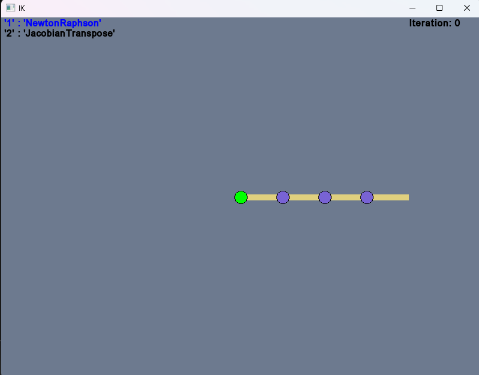
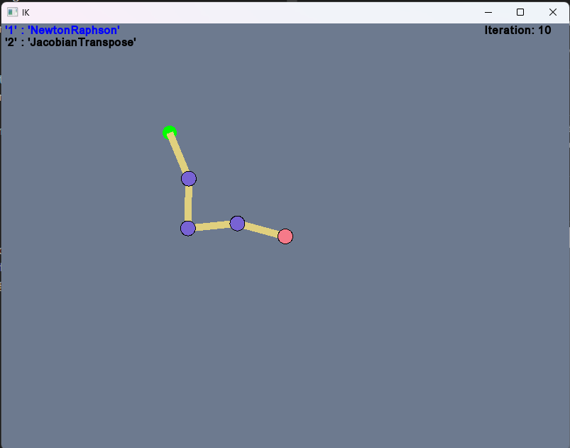
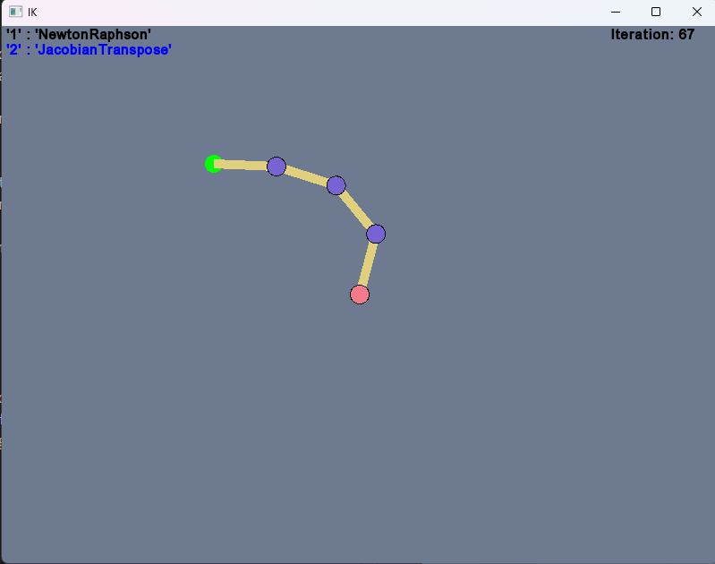
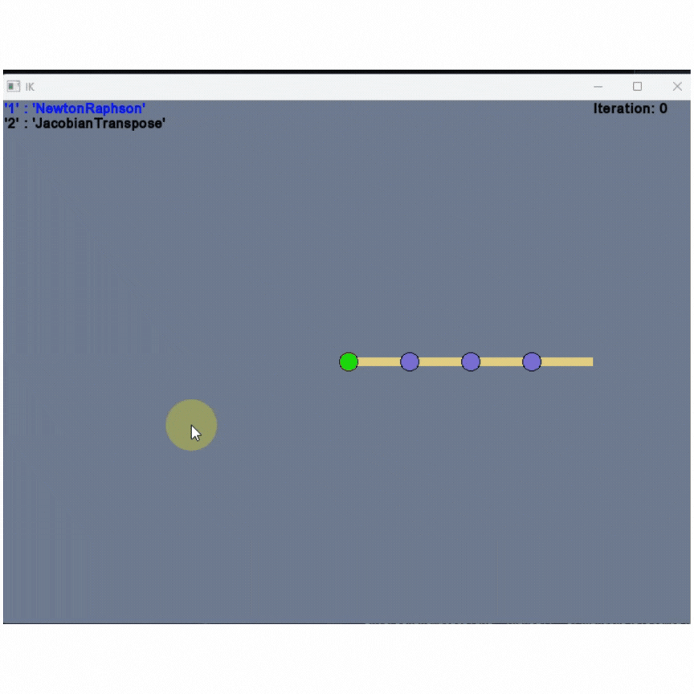

# **Project Description**

In this project, kinematic calculations are made to move the end effector of a robotic arm to a specific target, and this motion is visually represented using the SFML library. Inverse kinematics calculates the necessary joint angles to reach a given target. The project allows the user to interactively observe how the robotic arm moves toward different targets.

---

### **Features**
---
**Inverse Kinematics Calculations:** The robotic arm is calculated with the necessary joint angles to reach a specific target.

**SFML Visualization:** The movement of the robotic arm and the target point are visualized using **SFML**.

**Dynamic Target:** The user can change the target point and observe how the robot adjusts its movement to the new target.

**Various Robotic Arm Structures:** The movement of robotic arms with different segment lengths can be simulated.

---
### **Technologies Used**
---
- **C++     :** The primary language used in the project.
- **SFML    :** SFML is used for visualization and interaction.
- **Eigen   :** Mathematical operations and functions necessary for inverse kinematics calculations are applied using Eigen.

---

### **Outputs**
---

